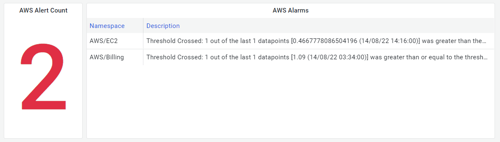

A simple exporter to get the existed AWS alarms and draw them into the Grafana panel.
This script works with help from the community.

Currently, it seems like there is no cost when collect this record type.

Sample panels:

I will update this README late.